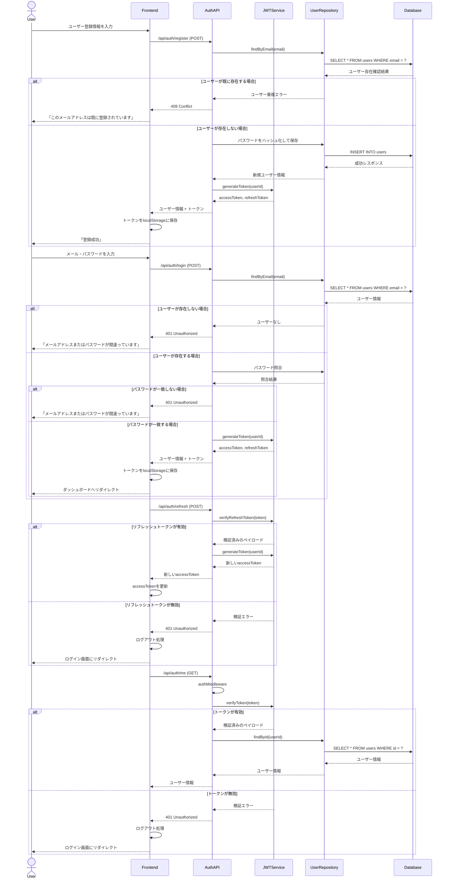

# Book Inventory Manager - システム設計ドキュメント

## システム概要

Book Inventory Manager は、書籍の在庫を管理するためのアプリケーションです。ユーザー認証機能を備え、認証されたユーザーのみが書籍データの作成、閲覧、更新、削除を行えます。

## アーキテクチャ

このアプリケーションは以下のコンポーネントで構成されています：

- **フロントエンド**: React + TypeScript (Vite)
- **バックエンド**: Node.js + TypeScript + Hono
- **データベース**: PostgreSQL（Prismaを使用）
- **認証**: JWT (JSON Web Token)

## ユースケース図

### 1. 認証関連のユースケース



### 2. 書籍管理のユースケース

```mermaid
sequenceDiagram
    actor User
    participant Frontend
    participant AuthMiddleware
    participant BookAPI
    participant BookRepository
    participant Database

    %% 書籍一覧取得プロセス
    User->>Frontend: 書籍一覧ページを開く
    Frontend->>BookAPI: /api/books (GET)
    BookAPI->>AuthMiddleware: 認証チェック
    
    alt 認証失敗
        AuthMiddleware-->>Frontend: 401 Unauthorized
        Frontend-->>User: ログイン画面にリダイレクト
    else 認証成功
        AuthMiddleware-->>BookAPI: 次の処理へ
        BookAPI->>BookRepository: getAllBooks()
        BookRepository->>Database: SELECT * FROM books
        Database-->>BookRepository: 書籍一覧データ
        BookRepository-->>BookAPI: 書籍一覧
        BookAPI-->>Frontend: 書籍一覧JSON
        Frontend-->>User: 書籍一覧を表示
    end

    %% 書籍詳細取得プロセス
    User->>Frontend: 書籍詳細を表示
    Frontend->>BookAPI: /api/books/:id (GET)
    BookAPI->>AuthMiddleware: 認証チェック
    
    alt 認証失敗
        AuthMiddleware-->>Frontend: 401 Unauthorized
        Frontend-->>User: ログイン画面にリダイレクト
    else 認証成功
        AuthMiddleware-->>BookAPI: 次の処理へ
        BookAPI->>BookRepository: getBookById(id)
        BookRepository->>Database: SELECT * FROM books WHERE id = ?
        Database-->>BookRepository: 書籍データ
        
        alt 書籍が存在しない
            BookRepository-->>BookAPI: null
            BookAPI-->>Frontend: 404 Not Found
            Frontend-->>User: 「書籍が見つかりません」
        else 書籍が存在する
            BookRepository-->>BookAPI: 書籍データ
            BookAPI-->>Frontend: 書籍データJSON
            Frontend-->>User: 書籍詳細を表示
        end
    end

    %% 書籍追加プロセス
    User->>Frontend: 新規書籍情報を入力
    Frontend->>BookAPI: /api/books (POST)
    BookAPI->>AuthMiddleware: 認証チェック
    
    alt 認証失敗
        AuthMiddleware-->>Frontend: 401 Unauthorized
        Frontend-->>User: ログイン画面にリダイレクト
    else 認証成功
        AuthMiddleware-->>BookAPI: 次の処理へ
        BookAPI->>BookRepository: バリデーション
        
        alt バリデーション失敗
            BookRepository-->>BookAPI: バリデーションエラー
            BookAPI-->>Frontend: 400 Bad Request
            Frontend-->>User: 入力エラーを表示
        else バリデーション成功
            BookAPI->>BookRepository: createBook(bookData)
            BookRepository->>Database: INSERT INTO books
            Database-->>BookRepository: 新規書籍データ
            BookRepository-->>BookAPI: 新規書籍データ
            BookAPI-->>Frontend: 新規書籍データJSON
            Frontend-->>User: 「書籍が追加されました」
        end
    end

    %% 書籍更新プロセス
    User->>Frontend: 書籍情報を編集
    Frontend->>BookAPI: /api/books/:id (PUT)
    BookAPI->>AuthMiddleware: 認証チェック
    
    alt 認証失敗
        AuthMiddleware-->>Frontend: 401 Unauthorized
        Frontend-->>User: ログイン画面にリダイレクト
    else 認証成功
        AuthMiddleware-->>BookAPI: 次の処理へ
        BookAPI->>BookRepository: バリデーション
        
        alt バリデーション失敗
            BookRepository-->>BookAPI: バリデーションエラー
            BookAPI-->>Frontend: 400 Bad Request
            Frontend-->>User: 入力エラーを表示
        else バリデーション成功
            BookAPI->>BookRepository: updateBook(id, bookData)
            BookRepository->>Database: UPDATE books SET ... WHERE id = ?
            Database-->>BookRepository: 更新結果
            
            alt 書籍が存在しない
                BookRepository-->>BookAPI: null
                BookAPI-->>Frontend: 404 Not Found
                Frontend-->>User: 「書籍が見つかりません」
            else 更新成功
                BookRepository-->>BookAPI: 更新された書籍データ
                BookAPI-->>Frontend: 更新された書籍データJSON
                Frontend-->>User: 「書籍が更新されました」
            end
        end
    end

    %% 書籍削除プロセス
    User->>Frontend: 書籍削除ボタンをクリック
    Frontend->>BookAPI: /api/books/:id (DELETE)
    BookAPI->>AuthMiddleware: 認証チェック
    
    alt 認証失敗
        AuthMiddleware-->>Frontend: 401 Unauthorized
        Frontend-->>User: ログイン画面にリダイレクト
    else 認証成功
        AuthMiddleware-->>BookAPI: 次の処理へ
        BookAPI->>BookRepository: deleteBook(id)
        BookRepository->>Database: DELETE FROM books WHERE id = ?
        Database-->>BookRepository: 削除結果
        
        alt 書籍が存在しない
            BookRepository-->>BookAPI: エラー
            BookAPI-->>Frontend: 404 Not Found
            Frontend-->>User: 「書籍が見つかりません」
        else 削除成功
            BookRepository-->>BookAPI: 成功レスポンス
            BookAPI-->>Frontend: 成功レスポンス
            Frontend-->>User: 「書籍が削除されました」
        end
    end
```



## ディレクトリ構造

```
book-inventory-manager/
├── backend/                # バックエンドコード
│   ├── src/
│   │   ├── application/    # アプリケーションロジック
│   │   ├── domain/         # ドメインモデル
│   │   ├── infrastructure/ # インフラストラクチャ実装
│   │   └── presentation/   # コントローラとルート
│   ├── prisma/             # Prismaスキーマと移行
│   └── ...
├── frontend/               # フロントエンドコード
│   ├── src/
│   │   ├── components/     # UIコンポーネント
│   │   ├── context/        # Reactコンテキスト
│   │   ├── hooks/          # カスタムフック
│   │   ├── pages/          # ページコンポーネント
│   │   └── services/       # APIサービス
│   └── ...
└── Document/               # ドキュメント
```

## APIエンドポイント

### 認証API

| エンドポイント         | メソッド | 説明                  | 認証必要 |
|----------------------|--------|----------------------|----------|
| `/api/auth/register` | POST   | 新規ユーザー登録        | いいえ    |
| `/api/auth/login`    | POST   | ユーザーログイン        | いいえ    |
| `/api/auth/refresh`  | POST   | アクセストークン更新    | いいえ    |
| `/api/auth/me`       | GET    | ログインユーザー情報取得 | はい      |

### 書籍API

| エンドポイント      | メソッド | 説明              | 認証必要 |
|-------------------|--------|------------------|----------|
| `/api/books`      | GET    | 書籍一覧を取得     | はい      |
| `/api/books/:id`  | GET    | 特定の書籍を取得   | はい      |
| `/api/books`      | POST   | 新規書籍を作成     | はい      |
| `/api/books/:id`  | PUT    | 書籍情報を更新     | はい      |
| `/api/books/:id`  | DELETE | 書籍を削除         | はい      |

## 認証フロー

1. ユーザーがログインすると、アクセストークンとリフレッシュトークンが発行されます
2. アクセストークンはlocalStorageに保存され、APIリクエストの`Authorization: Bearer [token]`ヘッダーで送信されます
3. アクセストークンが期限切れになると、リフレッシュトークンを使用して新しいアクセストークンを取得します
4. リフレッシュトークンも期限切れの場合、ユーザーは再度ログインする必要があります

## セキュリティ対策

1. パスワードはbcryptでハッシュ化して保存
2. JWT認証でAPIエンドポイントを保護
3. CORS設定で許可されたオリジンのみアクセス可能
4. 認証ミドルウェアでAPI保護